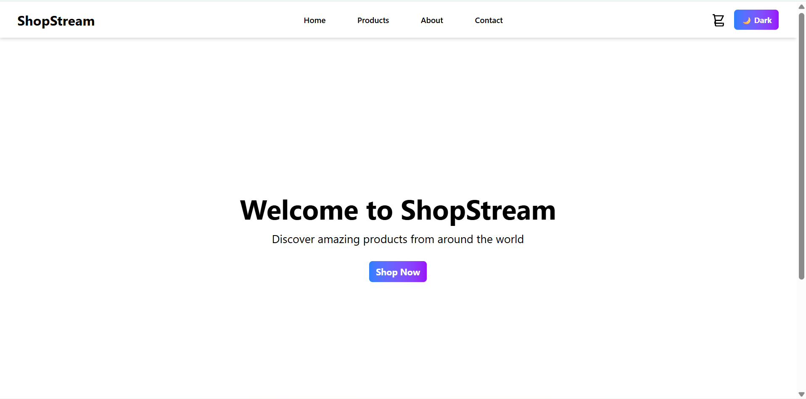
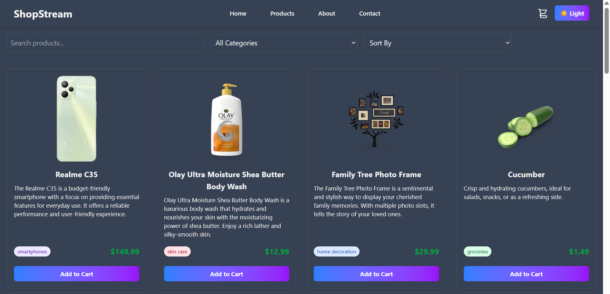

<div align="center">
<a name="top"></a>
  


# 🛒 ShopStream - E-commerce Product Listing Webpage

[](https://reactjs.org/)
[](https://vitejs.dev/)
[](https://tailwindcss.com/)
[](https://opensource.org/licenses/MIT)

A modern, responsive e-commerce application built with React and Vite. Features product listing with search, category filtering, sorting, infinite scrolling, shopping cart functionality, and dark/light theme toggle.






## 🌐 Demo video

[View Live Demo](https://drive.google.com/file/d/1hU9zVFF9EX9OuBJseOBAFt7SRAm4bmBh/view?usp=sharing)

</div>

## 🛠️ Tech Stack

- **Frontend**: React 19, Vite
- **Styling**: Tailwind CSS
- **Routing**: React Router DOM
- **HTTP Client**: Axios
- **State Management**: React Context API
- **Build Tool**: Vite
- **Package Manager**: npm

## 📋 Prerequisites

Before running this project, make sure you have the following installed:

- **Node.js** (version 16 or higher)
- **npm** (comes with Node.js)

You can check your versions by running:

```bash
node --version
npm --version
```

## 🔧 Installation

1. **Clone the repository**:

   ```bash
   git clone https://github.com/Ar-jun-fs9/product-listing-app.git
   cd product-listing-app
   ```

2. **Install dependencies**:

   ```bash
   npm install
   ```

3. **Start the development server**:

   ```bash
   npm run dev
   ```

4. **Open your browser** and navigate to `http://localhost:5173`

## 📖 Usage

### Navigation

- **Home (/)**: Welcome page with link to start shopping
- **Products (/products)**: Main product listing page with all features
- **Category URLs (/products/:category)**: View products filtered by specific category (e.g., `/products/beauty`, `/products/laptops`)
- **Cart (/cart)**: View and manage shopping cart items
- **About (/about)**: Information about the application
- **Contact (/contact)**: Contact information

### Features Overview

- **Search Bar**: Type to search products by name
- **Category Dropdown**: Select a category to filter products
- **Sort Dropdown**: Sort products by price
- **Add to Cart**: Click "Add to Cart" on any product to add it to your cart
- **Cart Management**: Update quantities, remove items, and view total price
- **Theme Toggle**: Switch between light and dark modes
- **Infinite Scroll**: Scroll down to load more products automatically

## 🏗️ Project Structure

```
ShopStream/
├── 📁 assets/                          # Top-level assets folder
│   ├── 🎥 demo-video.mp4               # Demo video for GitHub showcase
│   ├── 🖼️ homepage.png                 # Homepage screenshot
│   ├── 🖼️ products.png                 # Products page screenshot
│   ├── 🖼️ productsdarkmode.png         # Products page dark mode screenshot
│   └── 🖼️ cartlist.png                 # Cart page screenshot
│   └── 🖼️ shopstream.png               # logo sticker
│
├── 📁 public/
│   └── 📄 vite.svg
│
├── 📁 src/
│   ├── 📁 api/
│   │   └── 📄 products.js              # API calls to DummyJSON
│
│   ├── 📁 components/
│   │   ├── 📄 CategoryFilter.jsx       # Category selection dropdown
│   │   ├── 📄 Footer.jsx               # Footer component
│   │   ├── 📄 Header.jsx               # Header with navigation + theme toggle
│   │   ├── 📄 Loader.jsx               # Loading spinner
│   │   ├── 📄 Notification.jsx         # Notification component
│   │   ├── 📄 ProductCard.jsx          # Product card with add-to-cart
│   │   ├── 📄 SearchBar.jsx            # Search input
│   │   ├── 📄 SortDropdown.jsx         # Sorting options
│   │   └── 📄 ThemeToggle.jsx          # Dark/Light mode switcher
│
│   ├── 📁 contexts/
│   │   ├── 📄 CartContext.jsx          # Cart state management
│   │   ├── 📄 NotificationContext.jsx  # Notification state management
│   │   ├── 📄 ProductsContext.jsx      # Products state management
│   │   └── 📄 ThemeContext.jsx         # Theme state management
│
│   ├── 📁 hooks/
│   │   └── 📄 useInfiniteScroll.js     # Infinite scroll logic
│
│   ├── 📁 pages/
│   │   ├── 📄 About.jsx                # About page
│   │   ├── 📄 Cart.jsx                 # Cart page
│   │   ├── 📄 Contact.jsx              # Contact page
│   │   ├── 📄 Home.jsx                 # Home page
│   │   └── 📄 Products.jsx             # Products listing page
│
│   ├── 📄 App.jsx                      # Main App component
│   ├── 📄 main.jsx                     # Entry point
│   ├── 📄 index.css                    # Global styles
│   └── 📄 App.css                      # App-specific styles
│
├── 📄 .gitignore
├── 📄 package.json
├── 📄 vite.config.js
├── 📄 tailwind.config.js
├── 📄 eslint.config.js
├── 📄 index.html
├── 📄 LICENSE
└── 📄 README.md


```

## 🌐 API

This project uses the [DummyJSON Products API](https://dummyjson.com/products) with the following endpoint:

```
GET https://dummyjson.com/products?limit=1000&select=id,title,price,images,category,description
```

### Product Data Structure

Each product contains:

- `id`: Unique identifier
- `title`: Product name
- `price`: Product price
- `images`: Array of image URLs
- `category`: Product category
- `description`: Product description

## 🎨 Customization

### Adding New Categories

Update the `categories` array in `src/pages/Products.jsx` to include new categories.

### Modifying Product Card Layout

Edit `src/components/ProductCard.jsx` to change how products are displayed.

### Adding Cart Persistence

Implement localStorage in `src/contexts/CartContext.jsx` to persist cart across sessions.

### Styling

- Global styles: `src/index.css`
- Component styles: Use Tailwind classes in JSX
- Theme variables: Modify `tailwind.config.js`

## 🙏 Acknowledgments

- [DummyJSON](https://dummyjson.com/) for providing the product data API
- [Tailwind CSS](https://tailwindcss.com/) for the styling framework
- [React](https://reactjs.org/) for the UI library
- [Vite](https://vitejs.dev/) for the build tool

---

**License**

[](#)

<div align="center">
   
   **Happy Shopping! 🛒**  
  **[⬆ Back to Top](#top)**

</div>
